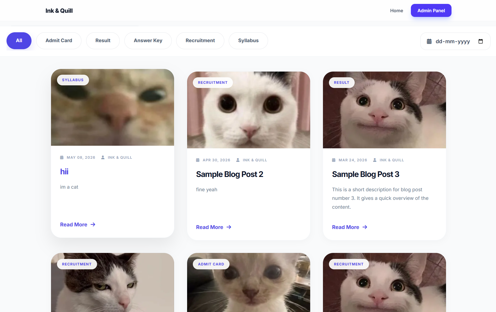
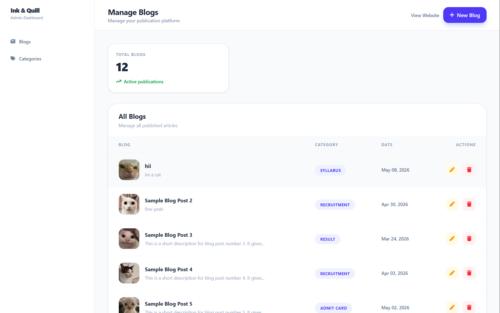

# Blog Management System

A full-stack Blog Management System built using Laravel, MySQL, AJAX, and jQuery.

This project allows users to view blogs while admins can manage blog posts through a clean dashboard interface. It also includes dynamic AJAX-based filtering without page reloads.

---

## Live Demo

[View Live Project](https://inkquill.infinityfree.me)

# Features

## User Side
- View all blog posts
- Read full blog details
- Responsive UI
- AJAX-based category filtering
- Real-time search functionality

## Admin Side
- Admin authentication/login
- Create blog posts
- Edit existing blogs
- Delete blogs
- Manage categories
- Upload blog images

## Technical Features
- AJAX + jQuery filtering
- Laravel MVC architecture
- MySQL database integration
- RESTful routing
- Responsive frontend design

---

# Tech Stack

## Frontend
- HTML
- CSS
- Bootstrap
- JavaScript
- jQuery
- AJAX

## Backend
- PHP
- Laravel

## Database
- MySQL

---

# Installation & Setup

## 1. Clone the Repository

```bash
git clone https://github.com/sadSanta-07/blog-system.git
```

---

## 2. Go to Project Directory

```bash
cd blog-management-system
```

---

## 3. Install Dependencies

```bash
composer install
```

---

## 4. Create Environment File

```bash
cp .env.example .env
```

---

## 5. Generate Application Key

```bash
php artisan key:generate
```

---

## 6. Configure Database

Open the `.env` file and update database credentials:

```env
DB_DATABASE=blog_system
DB_USERNAME=root
DB_PASSWORD=
```

---

## 7. Run Migrations

```bash
php artisan migrate
```

---

## 8. Start Development Server

```bash
php artisan serve
```

Project will run at:

```bash
http://127.0.0.1:8000
```

---

# Project Structure

```bash
app/
resources/views/
routes/
database/
public/
```

---

# Screenshots

## Home Page


## Blog Listing


## Admin Dashboard


# Future Improvements

- User authentication
- Comments system
- Rich text editor
- Blog likes/bookmarks
- Enhanced UI/UX
- Dark mode

---

# Author

Sahil Singh

---

# License

This project is open-source and available under the MIT License.
